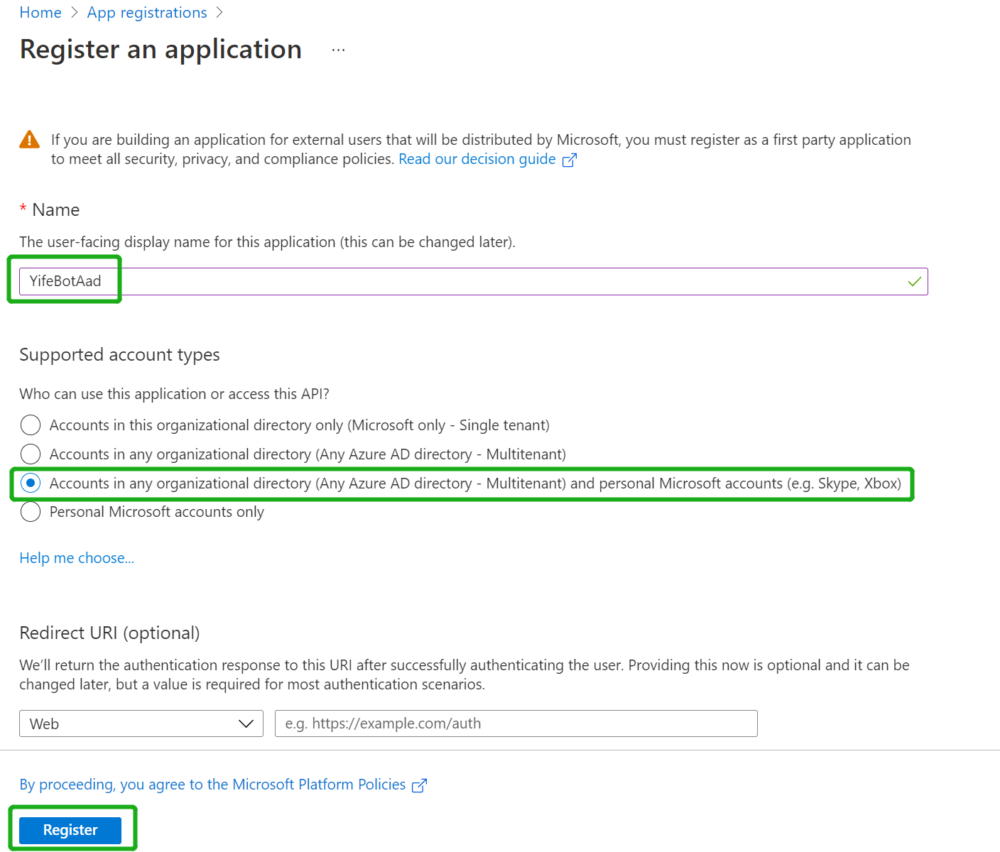
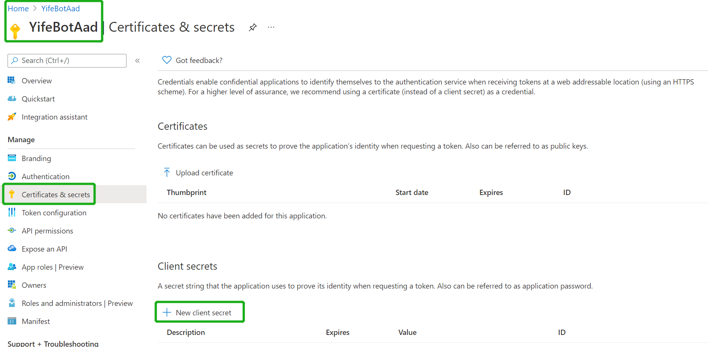
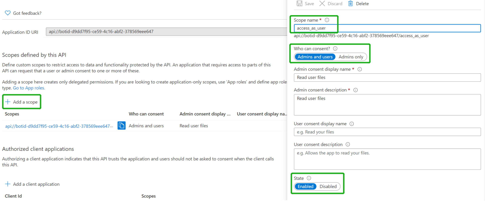
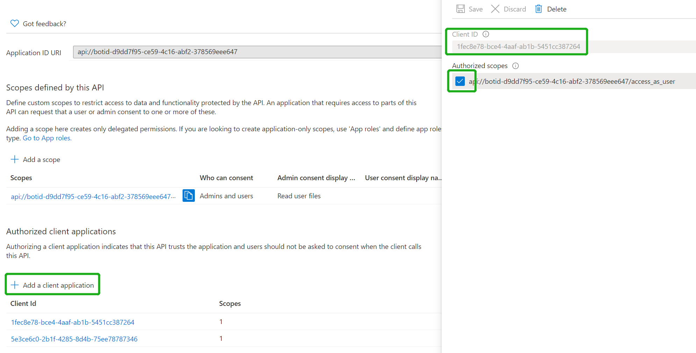
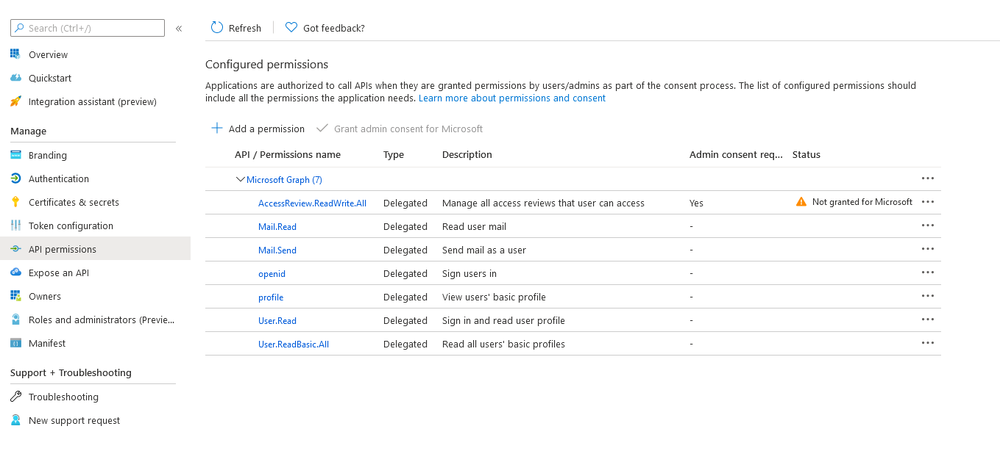
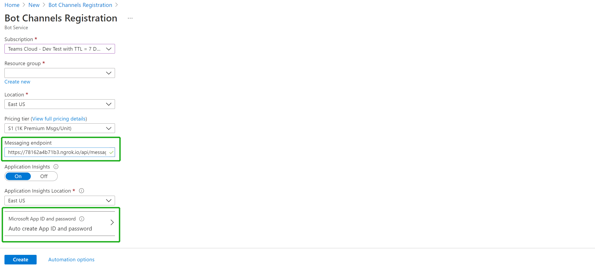
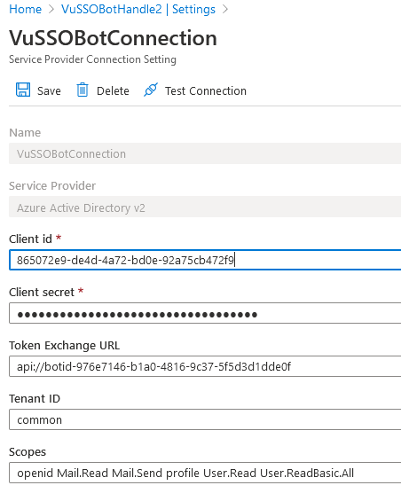
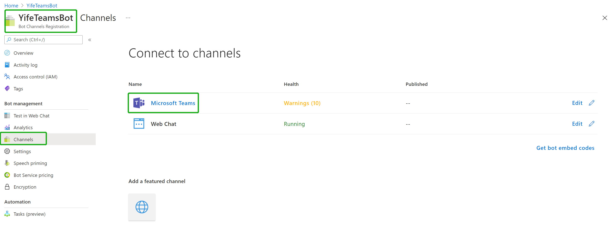

# Teams Bot with SSO

Teams Bot with SSO using Bot Framework v4.

This bot has been created using [Bot Framework](https://dev.botframework.com), it shows how to get started with SSO in a bot for Microsoft Teams.

The focus of this sample is how to use the Bot Framework support for OAuth SSO in your bot. Teams behaves slightly differently than other channels in this regard. Specifically an Invoke Activity is sent to the bot rather than the Event Activity used by other channels. _This Invoke Activity must be forwarded to the dialog if the OAuthPrompt is being used._ This is done by subclassing the ActivityHandler and this sample includes a reusable TeamsActivityHandler. This class is a candidate for future inclusion in the Bot Framework SDK.

The sample uses the bot authentication capabilities in [Azure Bot Service](https://docs.botframework.com), providing features to make it easier to develop a bot that authenticates users to various identity providers such as Azure AD (Azure Active Directory), GitHub, Uber, etc. The OAuth token is then used to make basic Microsoft Graph queries.

> IMPORTANT: The manifest file in this app adds "token.botframework.com" to the list of `validDomains`. This must be included in any bot that uses the Bot Framework OAuth flow.

## Prerequisites

- Microsoft Teams is installed and you have an account (not a guest account)
-  [NodeJS](https://nodejs.org/en/)
-  [ngrok](https://ngrok.com/) or equivalent tunneling solution
-  [M365 developer account](https://docs.microsoft.com/en-us/microsoftteams/platform/concepts/build-and-test/prepare-your-o365-tenant) or access to a Teams account with the appropriate permissions to install an app.

## To try this sample

> Note these instructions are for running the sample on your local machine, the tunnelling solution is required because
> the Teams service needs to call into the bot.

### 0. Clone the repository

```bash
git clone https://github.com/Microsoft/botbuilder-samples.git
```

### 1. Create and configure AAD app

#### 1.1 Create AAD app for SSO

This step will create an AAD app, it will be reused wherever it needs AAD throughout this sample to simpler the steps.

- Navigate to [Azure _App Registration_ Blade](https://ms.portal.azure.com/#blade/Microsoft_AAD_RegisteredApps/ApplicationsListBlade)

- Click "New Registration" on the upper left corner

- Fill out name and select third option for supported account type and click "Register":

    

- Navigate to the AAD app you just created, _copy and paste the Application ID(will referred as **AppId** in this document) somewhere safe_. You'll need it in a future step:
    

#### 1.2 Create Client Secret

- Navigate to the "Certificates & secrets" blade and add a client secret by clicking "New Client Secret"

    
</br>

- _Copy and paste the secret somewhere safe_. You'll need it in a future step

#### 1.3. Expose API endpoint

- Click "_Expose an API_" in the left rail

    - Update your application ID URL to include your bot id - api://botid-<AppId>, where <AppId> is the id of the bot that will be making the SSO request and found in your Teams Application Manifest, which is the same you create and saved in step1.1:
    

    - Click "_Add a scope_"

        - access_as_user as the Scope name.

        - Set Who can consent? to Admins and users

        - Fill in the fields for configuring the admin and user consent prompts with values that are appropriate for the access_as_user scope. Suggestions:

            - Admin consent title: Teams can access the user’s profile

            - Admin consent description: Allows Teams to call the app’s web APIs as the current user.

            - User consent title: Teams can access your user profile and make requests on your behalf

        - User consent description: Enable Teams to call this app’s APIs with the same rights that you have

        - Ensure that State is set to Enabled

        - Select Add scope (Note: The domain part of the Scope name displayed just below the text field should automatically match the Application ID URI set in the previous step, with /access_as_user appended to the end)

        

#### 1.4. Authorize client applications

Add the following Ids as authorized clients for your application

- 1fec8e78-bce4-4aaf-ab1b-5451cc387264 (Teams mobile/desktop application)

- 5e3ce6c0-2b1f-4285-8d4b-75ee78787346 (Teams web application)

    

#### 1.5. Add any necessary API permissions for downstream calls

- Navigate to "API permissions" blade on the left hand side

- Add any user delegated permissions that your app will need to downstream APIs, (like Microsoft Graph)

    


### 2. Setup bot in Azure Bot Service
#### 2.1. Run ngrok - point to port 3978

```bash
ngrok http -host-header=rewrite 3978
```

#### 2.2. Create new Bot Channel Registration resource in Azure

Create [Bot Framework registration resource](https://docs.microsoft.com/en-us/azure/bot-service/bot-service-quickstart-registration) in Azure
- For the "_Messaging endpoint_", use the current `https` URL you were given by running ngrok. Append with the path `/api/messages`:
- For "Microsoft App ID and password", click "Create New", fill in the AppId and client secret you created in step1.1 and step 1.2:

</br>

- Ensure that you've [enabled the Teams Channel](https://docs.microsoft.com/en-us/azure/bot-service/channel-connect-teams?view=azure-bot-service-4.0)
- __*If you don't have an Azure account*__ you can use this [Bot Framework registration](https://docs.microsoft.com/en-us/microsoftteams/platform/bots/how-to/create-a-bot-for-teams#register-your-web-service-with-the-bot-framework)


### 3. Setup Bot Service Connection (TokenStore)

- In the Azure Portal, navigate back to the Bot Channels Registration created in Step 2
   
    
- Switch to the "Settings" blade and click "Add Setting" under the OAuth Connection Settings section

    

- Fill out the Connection Setting form

    - Enter a name for your new Connection setting. This will be the name that gets referenced inside the settings of your bot service code in step 5

    - In the Service Provider dropdown, select Azure Active Directory V2

    - Enter in the client id and client secret obtained in step 2

    - For the Token Exchange URL use the Application ID URL obtained in step 2

    - Specify "common" as the Tenant ID

    - Add all the scopes configured when specifying permissions to downstream APIs in step 2

    - Click "Save"

    

### 4. Configure bot sample

   Update the `.env` configuration for the bot to use the Microsoft App Id and App Password from the Bot Framework registration. (Note the MicrosoftAppId is the AppId created in step 1.1, the MicrosoftAppPassword is referred to as the "client secret" in step1.2 and you can always create a new client secret anytime.)

### 5. Run your bot
Under the root of this sample folder, build and run by commands:
- `npm install`
- `npm start`

## Interacting with the bot in Teams

Navigate to your Bot Channels Registration created in step2.2, click "Microsoft Teams" channel, then you can interact with the bot in Teams web or client:


You can interact with this bot by sending it a message. The bot will respond by asking for your consent, by this consent the Bot will exchange an SSO token on behalf of you, then making a call to the Graph API on your behalf and returning the results.

## Deploy the bot to Azure

To learn more about deploying a bot to Azure, see [Deploy your bot to Azure](https://aka.ms/azuredeployment) for a complete list of deployment instructions.

## Further reading

- [Bot Framework Documentation](https://docs.botframework.com)
- [Bot Basics](https://docs.microsoft.com/azure/bot-service/bot-builder-basics?view=azure-bot-service-4.0)
- [Azure Portal](https://portal.azure.com)
- [Add Authentication to Your Bot Via Azure Bot Service](https://docs.microsoft.com/en-us/azure/bot-service/bot-builder-authentication?view=azure-bot-service-4.0&tabs=csharp)
- [Activity processing](https://docs.microsoft.com/en-us/azure/bot-service/bot-builder-concept-activity-processing?view=azure-bot-service-4.0)
- [Azure Bot Service Introduction](https://docs.microsoft.com/azure/bot-service/bot-service-overview-introduction?view=azure-bot-service-4.0)
- [Azure Bot Service Documentation](https://docs.microsoft.com/azure/bot-service/?view=azure-bot-service-4.0)
- [.NET Core CLI tools](https://docs.microsoft.com/en-us/dotnet/core/tools/?tabs=netcore2x)
- [Azure CLI](https://docs.microsoft.com/cli/azure/?view=azure-cli-latest)
- [Azure Portal](https://portal.azure.com)
- [Language Understanding using LUIS](https://docs.microsoft.com/en-us/azure/cognitive-services/luis/)
- [Channels and Bot Connector Service](https://docs.microsoft.com/en-us/azure/bot-service/bot-concepts?view=azure-bot-service-4.0)
- [Microsoft Teams Developer Platform](https://docs.microsoft.com/en-us/microsoftteams/platform/)
